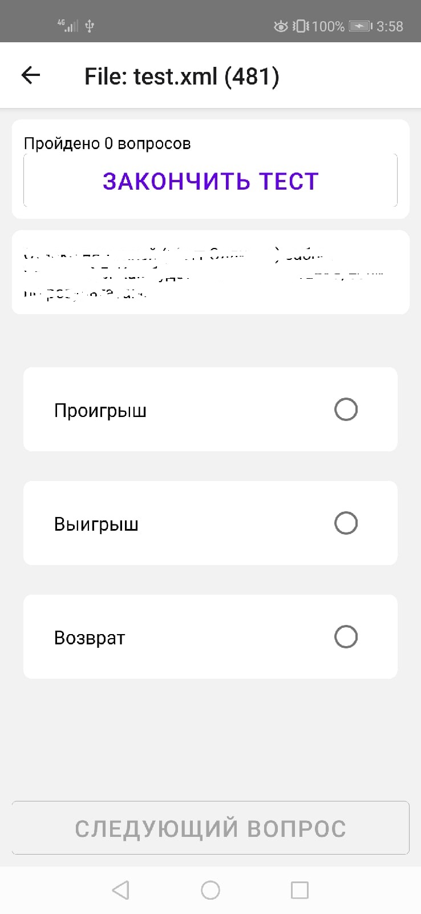
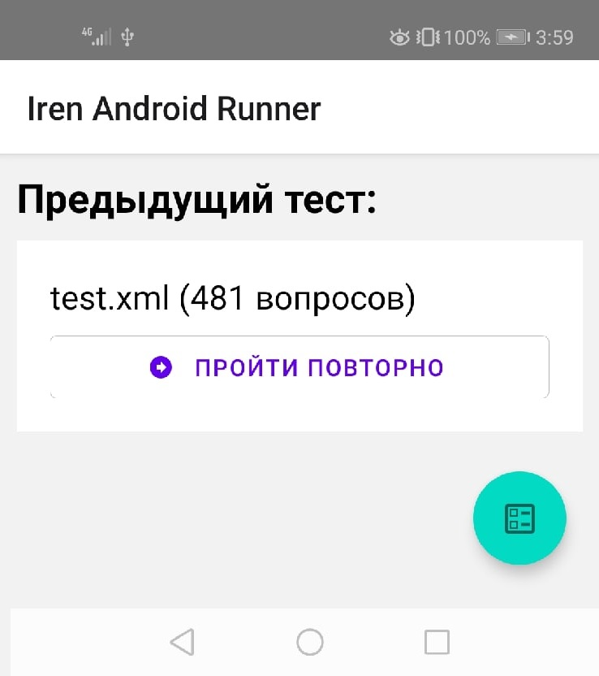

# Iren Android Launcher
Iren test launcher for android (possibly make it work on iphone, but lack of macbooks..)

## Made on

* React, React Native
* Redux, React-redux, Redux-Thunk
* react-native-zip-archive, react-native-paper

## How to use:

### Initial App Frame

  

On main window we can see FAB for selecting iren test file with format .it2

Workflow:
Press FAB - Select it2 file - pass test

### Test Frame

  

Here at top we can see passed tests and finish tests right now.
At the bottom 'next question' button and possible answers.

### Test Results Frame

  

Here we can see passed tests count and failed tests count.
At the screen center we can see failed questions with your answer and correct answer.

### Initial Screen after Test

  

After any passed or skipped test we can re-try right from main screen.

# Licensing
The app is open-source and used for non-commercial usage.
Iren name, icons, and other information was taken without agreement with Iren TradeMark owner.